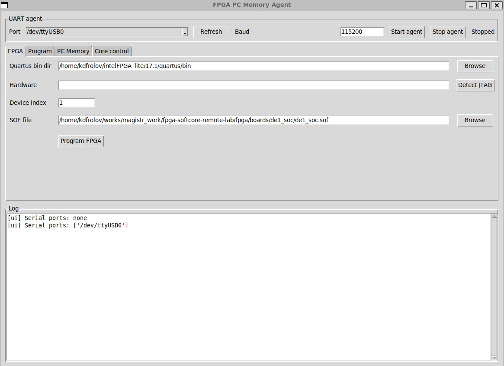
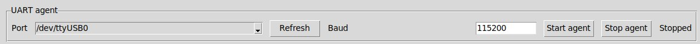
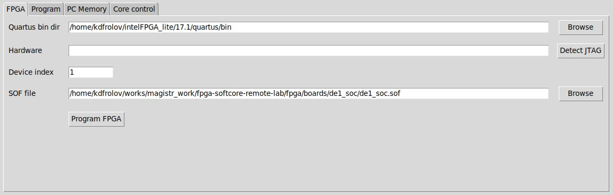
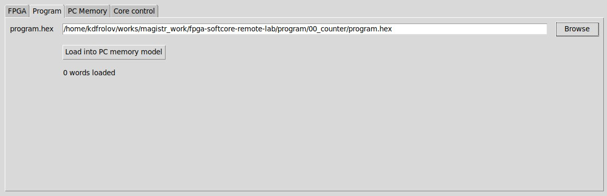
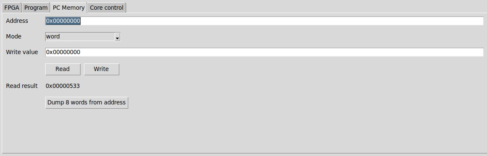
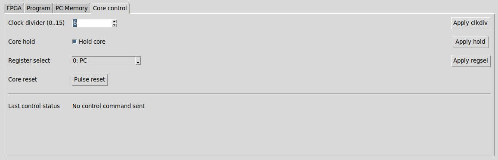
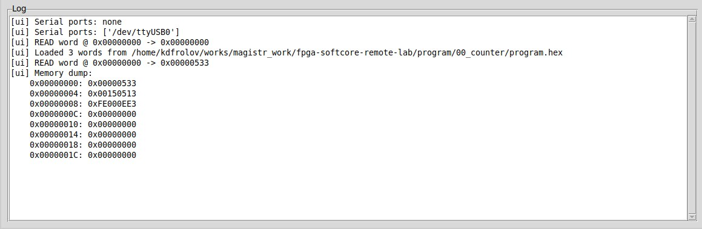

# Удаленный стенд для прототипирования софт-процессорных ядер

Программно-аппаратный комплекс для удаленной работы с софт-процессорным RISC-V-ядром с использованием платы ПЛИС.

## Структура репозитория

```text
.
├── cores_submodules/
|   └── schoolRISCV/
├── docs/
│   ├── DE1-SoC/
│   └── images/
├── fpga/
│   └── boards/
│       └── de1_soc/
├── program/
├── rtl/
│   ├── common/
│   │   └── uart_agent/
|   │       ├── uart_agent_proto.vh
|   │       ├── uart_mem_agent_2clk.v
|   │       ├── uart_rx.v
|   │       └── uart_tx.v
│   ├── cores/
│   │   └── schoolRISCV/
│   │       └── src/
│   └── lab_top.v
├── sw/
│   ├── app/
|   |   ├── __init__.py
|   |   ├── agent.py
|   |   ├── memory_model.py
|   |   ├── mock_stream.py
|   |   ├── programmer.py
|   |   ├── protocol.py
|   |   ├── serial_port.py
|   |   └── ui.py
│   ├── data/
|   |   └── program.hex
│   ├── tests/
|   |   ├── test_agent.py
|   |   ├── test_memory_model.py
|   |   └── test_protocol.py
│   └── main.py
└── testbench/
    └── sm_testbench.v
```

- **cores_submodules/schoolRISCV/** — сабмодуль репозитория ядра SchoolRISCV;
- **docs/** — документация к плате Altera DE1-SoC и каталог `images/` с изображениями, которые использованы в этом документе;
- **fpga/boards/de1_soc/** — проект Intel Quartus, который содержит файл конфигурации ПЛИС `de1_soc.sof`;
- **program/** — набор тестовых ассемблерных программ и их ассемблированные версии в файле `program.hex`;
- **rtl/common/uart_agent/** — файлы разработанного аппаратного UART-агента;
- **rtl/cores/schoolRISCV/src/** — файлы библиотечной подсистемы кэш-памяти из репозитория `IObundle`, интегрированной в систему;
- **rtl/lab_top.v** — верхнеуровневый файл системы на кристалле, содержит в себе ядро, подсистему кэш-памяти, аппаратный UART-агент;
- **sw/app/** — настольное приложение, содержит файлы пользовательского интерфейса, программного UART-агента, программатора ПЛИС и программной модели памяти;
- **sw/data/program.hex** — ассемблированная тестовая программа для загрузки в ядро при запуске приложения в режиме без пользовательского интерфейса;
- **sw/tests/** — модульные тесты отдельных компонентов настольного приложения;
- **sw/main.py** — скрипт запуска настольного приложения (точка входа);
- **testbench/sm_testbench.v** — тестбенч для тестирования аппаратной части проекта.

## UART-протокол

Структура UART-пакета:

```text
[SOF=0xA5][TYPE][SEQ][LEN][PAYLOAD][XOR]
```

Где:

- `SOF` — байт начала пакета;
- `TYPE` — тип пакета;
- `SEQ` — номер последовательности;
- `LEN` — длина полезной нагрузки в байтах;
- `PAYLOAD` — полезная нагрузка переменной длины;
- `XOR` — контрольная сумма, вычисляемая по полям `TYPE`, `SEQ`, `LEN` и байтам полезной нагрузки.

### Поддерживаемые типы пакетов

- Доступ к памяти:
  - `IREAD_REQ` / `IREAD_RESP` — запрос/ответ на чтение инструкций из памяти;
  - `DREAD_REQ` / `DREAD_RESP` — запрос/ответ на чтение данных из памяти;
  - `WRITE_REQ` / `WRITE_RESP` — запрос/ответ на запись данных в память;
- Управление ядром:
  - `SET_CLKDIV_REQ` / `SET_CLKDIV_RESP` — запрос/ответ на команду изменения делителя тактовой частоты;
  - `SET_HOLD_REQ` / `SET_HOLD_RESP` — запрос/ответ на команду остановки/запуска ядра;
  - `CORE_RESET_REQ` / `CORE_RESET_RESP` — запрос/ответ на команду перезагрузки ядра;
  - `SET_REGSEL_REQ` / `SET_REGSEL_RESP` — запрос/ответ на команду выбора регистра/программного счетчика для вывода на HEX-дисплей;

## Описание графического интерфейса

Интерфейс реализован с использованием библиотеки `Tkinter` в модуле `sw/app/ui.py`.
Общий вид приложения представлен ниже:



### Панель `UART agent`



Содержит следующие компоненты:
- Поле выбора последовательного порта с выпадающим списком доступных устройств;
- Кнопка обновления списка доступных устройств;
- Поле ввода скорости передачи данных по UART;
- Кнопки запуска и остановки агента;
- Индикатор состояния режима работы агента.

### Панель `FPGA`



Содержит следующие компоненты:
- Поле выбора каталога с исполняемыми файлами Quartus, что позволяет настроить работу приложения на различных компьютерах, не привязываясь к конкретному расположению Quartus в системе;
- Кнопка детектирования доступного JTAG-интерфейса с полем вывода информации о нем;
- Поле выбора индекса устройства в JTAG-цепочке;
- Поле выбора файла прошивки формата *.sof;
- Кнопка загрузки прошивки на ПЛИС.

### Панель `Program`



Содержит следующие компоненты:
- Поле выбора файла с программой `program.hex`;
- Кнопка открытия меню выбора файла;
- Кнопка загрузки содержимого в программную модель памяти на стороне ПК;
- Текстовый индикатор, отображающий количество успешно загруженных слов.

### Панель `PC Memory`



Содержит следующие компоненты:
- Поле ввода адреса в памяти;
- Выпадающий список выбора режима чтения/записи (`word`, `half`, `byte`);
- Кнопки выполнения операций чтения и записи;
- Поле вывода результата чтения из памяти;
- Кнопка вывода 8-ми последовательных слов, начиная с заданного адреса, в блок журнала событий.

### Панель `Core control`



Содержит следующие компоненты:
- Поле ввода делителя частоты в диапазоне от 0 до 15 с кнопкой отправки соответствующей команды процессору;
- Переключатель остановки и запуска ядра с кнопкой отправки соответствующей команды процессору;
- Выпадающий список выбора номера регистра (x1-x31) или программного счетчика для вывода значения на HEX-дисплей платы с кнопкой отправки соответствующей команды процессору, вид выпадающего списка представлен на рис. 30;
- Кнопка перезагрузки процессора;
- Поле состояния последней управляющей команды, в котором отображается результат ее выполнения.

### Панель `Log`



В журнале выводятся сообщения о:
- запуске и остановке UART-агента;
- найденных последовательных портах;
- загрузке программы;
- операциях чтения и записи памяти;
- результате загрузки прошивки на плату ПЛИС;
- результате выполнения отладочных команд.

## Требования

Типичная среда запуска:

- Python 3.10 или новее;
- установленный Tkinter;
- установленный Intel Quartus для программирования FPGA;
- доступ к последовательному порту целевой платы через преобразователь USB-UART.

## Запуск

```bash
python sw/main.py
```

## Типовой сценарий работы

1. Подключите плату по JTAG и USB-UART;
2. Запустите графическое приложение;
3. Обнаружьте JTAG-оборудование и загрузите файл конфигурации `de1_soc.sof` на ПЛИС;
4. Загрузите `program.hex` в программную модель памяти;
5. Запустите UART-агент;
6. Используйте вкладки памяти и управления ядром для наблюдения и управления выполнением.
